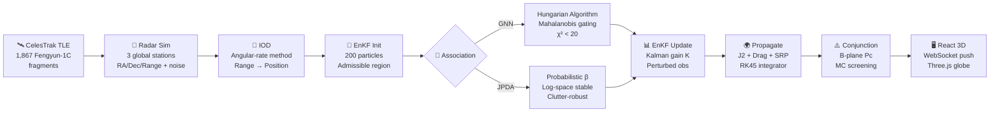

# ORBIT GUARD AI — One-Page Cheat Sheet

## Data Flow Pipeline

## Key Equations (One-Line Each)

| Equation | What It Does |
|---|---|
| `r̈ = -μ/r³·r + a_J2 + a_drag + a_SRP` | Satellite acceleration (gravity + perturbations) |
| `K = P_xy · (P_yy + R)⁻¹` | Kalman gain — balances trust in prediction vs measurement |
| `d² = (z-ẑ)ᵀ S⁻¹ (z-ẑ)` | Mahalanobis distance — "how many σ away?" for gating |
| `β_j = P_D·L_j / (λ_c + Σ P_D·L_k)` | JPDA probability — measurement j belongs to this track |
| `IG = log|S| - log|R|` | Information gain — which track benefits most from radar |
| `Pc = π·R² · pdf₂D(miss)` | Collision probability — B-plane integral over hard body |

## Quick Reference — Acronyms

| Term | Meaning | Term | Meaning |
|---|---|---|---|
| **TLE** | Two-Line Element set | **EnKF** | Ensemble Kalman Filter |
| **ECI** | Earth-Centered Inertial | **GNN** | Global Nearest Neighbor |
| **ECEF** | Earth-Centered Earth-Fixed | **JPDA** | Joint Probabilistic Data Association |
| **J2** | Earth oblateness harmonic | **IOD** | Initial Orbit Determination |
| **SRP** | Solar Radiation Pressure | **NIS** | Normalized Innovation Squared |
| **GMST** | Greenwich Mean Sidereal Time | **STM** | State Transition Matrix |
| **RTN** | Radial-Transverse-Normal frame | **TCA** | Time of Closest Approach |
| **LEO** | Low Earth Orbit (200-2000 km) | **Pc** | Probability of Collision |
| **HBR** | Hard Body Radius | **RK45** | Runge-Kutta 4th/5th order |

## Architecture at a Glance

| Layer | Files | Purpose |
|---|---|---|
| **Data** | [data_loader.py](file:///Users/rajiv/Desktop/ORBIT-GUARD-COMPLETE-BOTH-2026-03-11/short-arc-ai-workspace/src/data_loader.py), `fengyun_1c.txt` | Download & parse 1,867 Fengyun-1C TLEs from CelesTrak |
| **Simulation** | [radar_sim.py](file:///Users/rajiv/Desktop/ORBIT-GUARD-COMPLETE-BOTH-2026-03-11/short-arc-ai-workspace/src/simulation/radar_sim.py), [multi_object_scenarios.py](file:///Users/rajiv/Desktop/ORBIT-GUARD-COMPLETE-BOTH-2026-03-11/short-arc-ai-workspace/src/simulation/multi_object_scenarios.py) | Skyfield-based radar measurements from 3 global stations |
| **Orbit Mechanics** | [perturbations.py](file:///Users/rajiv/Desktop/ORBIT-GUARD-COMPLETE-BOTH-2026-03-11/short-arc-ai-workspace/src/orbital_mechanics/perturbations.py), [propagator.py](file:///Users/rajiv/Desktop/ORBIT-GUARD-COMPLETE-BOTH-2026-03-11/short-arc-ai-workspace/src/orbital_mechanics/propagator.py), [kepler_utils.py](file:///Users/rajiv/Desktop/ORBIT-GUARD-COMPLETE-BOTH-2026-03-11/short-arc-ai-workspace/src/orbital_mechanics/kepler_utils.py) | J2+Drag+SRP physics, RK45/DOP853 integration, coordinate transforms |
| **Estimation** | [ensemble_kalman_filter.py](file:///Users/rajiv/Desktop/ORBIT-GUARD-COMPLETE-BOTH-2026-03-11/short-arc-ai-workspace/src/orbit_determination/ensemble_kalman_filter.py), [gauss_iod.py](file:///Users/rajiv/Desktop/ORBIT-GUARD-COMPLETE-BOTH-2026-03-11/short-arc-ai-workspace/src/orbit_determination/gauss_iod.py), [adaptive_noise.py](file:///Users/rajiv/Desktop/ORBIT-GUARD-COMPLETE-BOTH-2026-03-11/short-arc-ai-workspace/test_adaptive_noise.py) | 200-particle EnKF, angular-rate IOD, NIS-based adaptive noise |
| **Association** | [gnn_associator.py](file:///Users/rajiv/Desktop/ORBIT-GUARD-COMPLETE-BOTH-2026-03-11/short-arc-ai-workspace/src/association/gnn_associator.py), [jpda_associator.py](file:///Users/rajiv/Desktop/ORBIT-GUARD-COMPLETE-BOTH-2026-03-11/short-arc-ai-workspace/src/association/jpda_associator.py) | Hungarian algorithm (GNN) vs probabilistic (JPDA) |
| **Tracking** | [track_hypothesis.py](file:///Users/rajiv/Desktop/ORBIT-GUARD-COMPLETE-BOTH-2026-03-11/short-arc-ai-workspace/src/tracking/track_hypothesis.py), [tracking_system.py](file:///Users/rajiv/Desktop/ORBIT-GUARD-COMPLETE-BOTH-2026-03-11/short-arc-ai-workspace/src/tracking_system.py), [maneuver.py](file:///Users/rajiv/Desktop/ORBIT-GUARD-COMPLETE-BOTH-2026-03-11/short-arc-ai-workspace/src/tracking/maneuver.py), [catalog.py](file:///Users/rajiv/Desktop/ORBIT-GUARD-COMPLETE-BOTH-2026-03-11/short-arc-ai-workspace/src/tracking/catalog.py) | Track lifecycle, multi-object tracker, ΔV estimation, TLE correlation |
| **Safety** | [conjunction.py](file:///Users/rajiv/Desktop/ORBIT-GUARD-COMPLETE-BOTH-2026-03-11/short-arc-ai-workspace/test_conjunction.py) | B-plane Pc computation, STM covariance propagation, risk classification |
| **Scheduling** | [information_scheduler.py](file:///Users/rajiv/Desktop/ORBIT-GUARD-COMPLETE-BOTH-2026-03-11/short-arc-ai-workspace/src/scheduling/information_scheduler.py) | Entropy-based radar tasking with visibility checks |
| **Classification** | [regime_classifier.py](file:///Users/rajiv/Desktop/ORBIT-GUARD-COMPLETE-BOTH-2026-03-11/short-arc-ai-workspace/src/classification/regime_classifier.py) | RandomForest + physics rules for LEO/MEO/GEO/HEO/GTO |
| **Backend API** | [run_live_3d_tracking.py](file:///Users/rajiv/Desktop/ORBIT-GUARD-COMPLETE-BOTH-2026-03-11/short-arc-ai-workspace/run_live_3d_tracking.py) | FastAPI + WebSocket, ECI→ECEF conversion, event streaming |
| **Frontend** | [App.jsx](file:///Users/rajiv/Desktop/ORBIT-GUARD-COMPLETE-BOTH-2026-03-11/orbit-ui/src/App.jsx) + 12 components | React Three Fiber globe, Bloom post-processing, HUD overlay |

## Key Numbers

| Parameter | Value | Why |
|---|---|---|
| Particles | 200 | Sweet spot: 100 too noisy, 500 too slow |
| GNN gate | χ² < 20.0 | 99.9% confidence for 3-DOF measurements |
| JPDA gate | χ² < 25.0 | Tighter for fewer false associations |
| Process noise (pos) | 0.05 km | Fixed; adaptive tested worse for passive debris |
| Process noise (vel) | 0.0005 km/s | Matches LEO perturbation magnitudes |
| Covariance inflation | 1.02× | Fixed; adaptive caused velocity explosions |
| Angle noise | 0.2° (sim: 0.01°) | Realistic tracking radar accuracy |
| Range noise | 5.0 km | Standard for surveillance radar |
| Detection probability | 0.98 | High P_D for modern radars |
| Clutter density | 1e-8 | Space is very clean |
| HBR | 15 m (0.015 km) | Typical small satellite/debris size |
| Pc RED threshold | 1e-4 | NASA CARA standard for maneuver decision |
| Speed bounds | 5-10 km/s | Physical LEO velocity range |
| Altitude bounds | 200-3000 km | LEO tracking regime |
