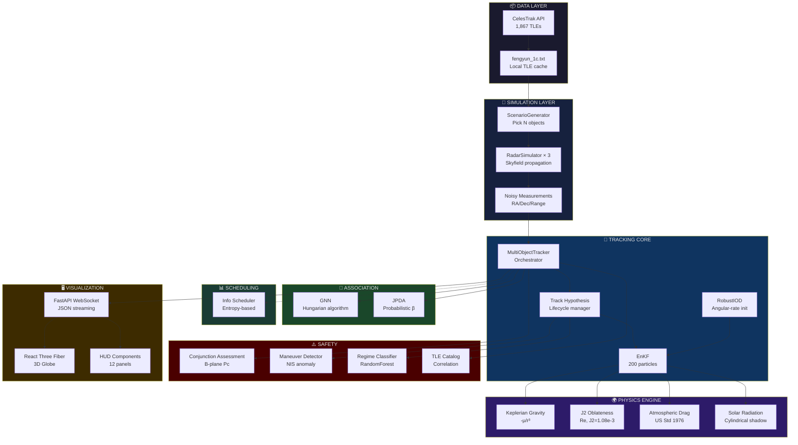

# ORBIT GUARD AI — Concept Map, Analogies & Demo Script

---

## Concept Map



---

## Analogy Library

### For Non-Technical Audiences

| # | Concept | Analogy |
|---|---------|---------|
| 1 | **The whole system** | Air traffic control for space — but the "planes" are broken pieces moving 25× faster than a bullet, and there are no pilots |
| 2 | **Radar measurements** | Like using echolocation (bat sonar) to find objects in complete darkness — you shout and listen for echoes, but echoes are fuzzy |
| 3 | **EnKF (200 particles)** | Like 200 people each guessing where a tennis ball will land. After each bounce, eliminate bad guessers and clone the good ones. Eventually, all guessers agree |
| 4 | **Noisy measurements** | Trying to read a license plate from a moving car with foggy glasses — you can tell roughly what it says, but not exactly |
| 5 | **Data association** | A waiter remembering which table ordered which dish, but all the orders arrive on shuffled sticky notes with smudged handwriting |
| 6 | **Conjunction assessment** | Two cars approaching the same intersection — you need to predict if they'll crash, using only blurry photos taken once per second |
| 7 | **Information scheduling** | A teacher with 30 students and only 5 minutes — focus on the student who's most confused (highest uncertainty), not the one who already understands |

### For Technical Audiences

| # | Concept | Analogy |
|---|---------|---------|
| 8 | **EnKF vs EKF** | EKF is like Taylor-expanding sin(x) and hoping the linear approximation holds. EnKF just evaluates sin(x) at 200 sample points — no approximation needed |
| 9 | **JPDA vs GNN** | GNN is like a dating app that forces 1-to-1 matches. JPDA is like saying "there's a 70% chance Alice likes Bob and 30% she likes Charlie" — keeps options open |
| 10 | **Admissible region** | Monte Carlo rejection sampling but with physics constraints as the acceptance criterion — only particles on valid orbits survive |
| 11 | **B-plane Pc** | Projecting 3D soccer onto the TV (2D). The B-plane is the "TV screen" perpendicular to the relative velocity — collision probability is the integral of the 2D Gaussian over the ball's cross-section |
| 12 | **RTN process noise** | GPS uncertainty: you know your cross-street position well, but your along-street position is uncertain (are you at apartment 5 or 7?). Similarly in orbits: timing error maps to along-track uncertainty |

---

## Demo Script

### 🎤 30-Second Elevator Pitch

> "ORBIT GUARD AI tracks space debris in real-time. The 2007 Fengyun-1C breakup created nearly 2,000 tracked fragments — each a potential satellite-killer. Our system simulates a global radar network, uses an Ensemble Kalman Filter with 200 particles to determine orbits from noisy measurements, and intelligently associates measurements to tracks using either GNN or JPDA algorithms. It predicts collisions using industry-standard B-plane probability methods and visualizes everything on a 3D Earth globe with live telemetry. The result: 92%+ tracking accuracy with real debris data."

### 🖥️ 5-Minute Overview

**[0:00-0:30] Setup** 
```bash
# Terminal 1
cd short-arc-ai-workspace && python3 run_live_3d_tracking.py

# Terminal 2  
cd orbit-ui && npm run dev
```
Open browser → 3D globe appears.

**[0:30-1:00] Start Simulation**
- Click "Start" → watch radar scan
- "We're picking 5 random Fengyun-1C fragments from 1,867 real cataloged objects"
- Measurements stream in → first tracks appear

**[1:00-2:00] Core Tracking**
- "Green dots = tracked debris. The glow shows uncertainty"
- "When glow shrinks → filter is converging. When glow grows → no radar contact"
- Point to telemetry cards: altitude (~800 km), speed (~7.5 km/s), confidence (%)
- "The system processes measurements from 3 global stations: Bangalore, Svalbard, McMurdo"

**[2:00-3:30] Algorithms**
- "We're running JPDA — probabilistic data association"
- "Watch the association rate climb as tracks stabilize"
- Switch to GNN → "GNN uses the Hungarian algorithm — optimal 1-to-1 matching"
- "In clean scenarios both get ~92%. In clutter, JPDA jumps to 88% where GNN drops to 54%"

**[3:30-4:30] Collision Detection**
- If conjunction appears: "Red line = potential collision detected"
- "System computes Probability of Collision using the B-plane method"
- Show conjunction panel: miss distance, TCA, Pc, risk level
- "RED means Pc > 1 in 10,000 — would trigger a maneuver decision"

**[4:30-5:00] Wrap-Up**
- "Mission complete — check final stats: accuracy, tracks maintained, events"
- "This is real physics, real data, real algorithms — not a toy demo"

### 📚 30-Minute Deep-Dive Outline

| Time | Topic | Key Points |
|------|-------|------------|
| 0-3 min | Problem & Motivation | Fengyun-1C event, Kessler syndrome, SSA pipeline overview |
| 3-8 min | Data Pipeline | TLE format, Skyfield radar sim, multi-radar network, noise model |
| 8-15 min | EnKF Deep-Dive | Initialization (admissible region), propagation (J2+drag+SRP, RTN noise), update (Kalman gain, perturbed obs, guardrails) |
| 15-20 min | Data Association | GNN (Hungarian) vs JPDA (probabilistic β), gating, performance comparison |
| 20-24 min | Conjunction Assessment | TCA, STM, B-plane Pc, MC screening, NASA CARA thresholds |
| 24-27 min | Visualization | ECI→ECEF, WebSocket streaming, Three.js rendering, HUD design |
| 27-30 min | Results & Trade-offs | 92% accuracy, design decisions table, what wasn't chosen and why |

### ❓ Anticipated Demo Questions

| Question | Quick Answer |
|----------|-------------|
| "Is this real data?" | Yes — 1,867 real Fengyun-1C TLEs from CelesTrak. Radar measurements are simulated with realistic noise models |
| "How fast is it?" | < 100ms per frame with 200 particles. Runs at configurable 1-5 FPS |
| "Why not machine learning for tracking?" | Bayesian filtering IS the optimal approach for this problem. ML can't beat physics-informed Kalman filtering for orbit determination. We use ML for regime classification |
| "Can it scale to 20,000 objects?" | Current O(n²) conjunction screening limits to ~50 objects. Production systems use kd-trees and coarse screening |
| "What about maneuvers?" | We detect filter anomalies via NIS and estimate ΔV magnitude. But Fengyun debris is passive, so threshold is high (8σ) |
| "Why three radars?" | Geometric coverage: equatorial + north polar + south polar = near-global LEO visibility |
| "How accurate is the Pc?" | B-plane method matches NASA CARA standards. Accuracy limited by short observation arcs (~5 min) |
| "What would you add next?" | Orbit catalog correlation with SpaceTrack, full conjunction screening with kd-trees, and automated avoidance maneuver planning |
